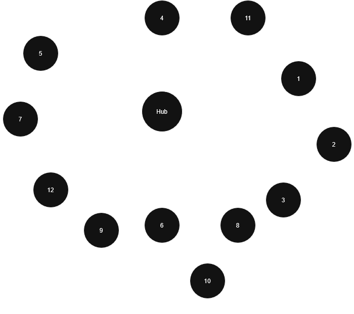
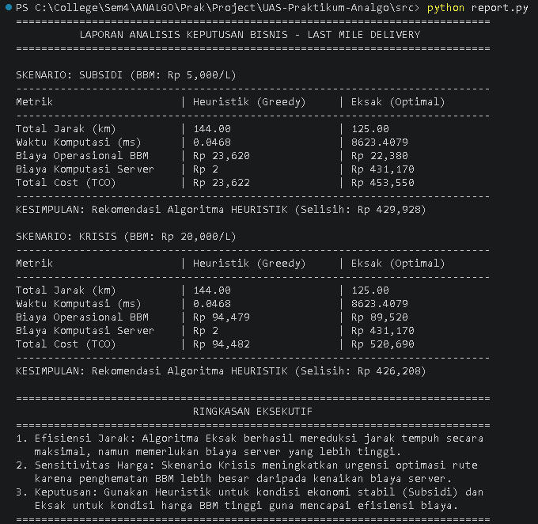
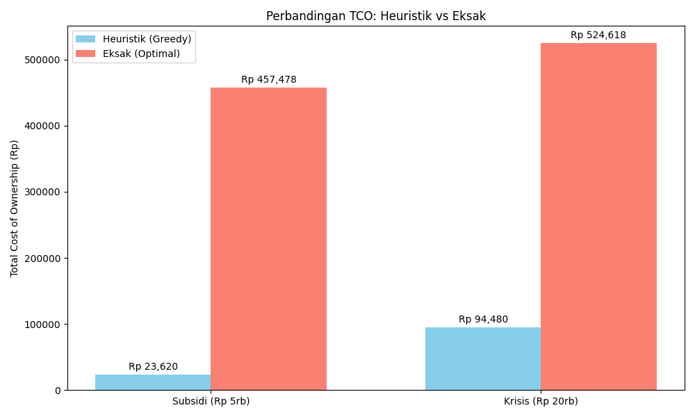

# Last-Mile Delivery Optimization - UAS Praktikum Analisis Algoritma

<p align="center">
  
</p>

## Anggota Kelompok & Peran
- **Dean Frederic Wijaya (140810240027)**: Implementasi Algoritma (Eksak).
- **Hansel Stevan Boike (140810240079)**: Implementasi Algoritma(Heuristik) & Implementasi Data Loader.
- **Satrio Rafi Fahrezi (140810240063)**: Perancangan *Cost Function* & Beban Dinamis.
- **Steven Hapnico S.N. (140810240065)**: Pemodelan Skenario Ekonomi & Validasi Data.
- **Valensius Alven (140810240059)**: Analisis Keputusan Bisnis, Visualisasi Komparatif TCO, & Pelaporan Strategis.
- **Pemodelan Data**: Kolaborasi Tim (5 orang).

## Deskripsi Proyek
Proyek ini bertujuan untuk memecahkan dilema infrastruktur teknologi operasional pada perusahaan ekspedisi. Kami membandingkan dua pendekatan algoritma untuk menyelesaikan *Traveling Salesperson Problem* (TSP) dalam konteks pengantaran barang (*Last-Mile Delivery*):
1. **Algoritma Heuristik (Greedy Nearest Neighbor)**: Menawarkan kecepatan eksekusi instan namun dengan rute yang sub-optimal.
2. **Algoritma Eksak (Backtracking with Pruning)**: Menjamin rute terpendek absolut namun memerlukan biaya komputasi server yang lebih tinggi.

Analisis difokuskan pada **Total Cost of Ownership (TCO)** yang menggabungkan biaya bahan bakar (berdasarkan beban paket dinamis) dan biaya server komputasi awan.

## Panduan Menjalankan Program
Pastikan Anda memiliki Python 3 terinstal. Jalankan perintah berikut dari direktori utama proyek:

```bash
# Menjalankan simulasi satu skenario ekonomi
python src/main.py --scenario subsidy
python src/main.py --scenario crisis

# Menjalankan laporan perbandingan dua skenario wajib
python src/report.py
```

Keterangan output:
- `python src/main.py --scenario subsidy|crisis`
  - menjalankan algoritma Heuristik dan Eksak untuk satu skenario ekonomi
  - menampilkan rute, total jarak, waktu eksekusi, validasi rute, dan analisis biaya
- `python src/report.py`
  - membandingkan skenario `subsidy` dan `crisis`
  - menampilkan urutan rute kedua algoritma, tabel TCO, analisis break-even harga BBM, dan ringkasan eksekutif

Makna break-even:
- break-even harga BBM = harga per liter saat TCO Heuristik sama dengan TCO Eksak
- jika harga BBM aktual masih di bawah nilai ini, Heuristik tetap lebih murah
- jika harga BBM melampaui nilai ini, Eksak baru mulai layak dipertimbangkan secara biaya

## Hasil Simulasi & Komparasi

Berikut adalah visualisasi hasil eksekusi komparasi kedua algoritma pada skenario yang berbeda.

### Output Eksekusi Terminal
Menampilkan perincian komputasi jarak, waktu eksekusi, dan rincian biaya operasional:


### Grafik Perbandingan TCO
Visualisasi perbandingan biaya total (TCO) antara algoritma Heuristik dan Eksak:


## Analisis Algoritma

### 1. Heuristik (Greedy Nearest Neighbor)
- **Trade-off**: Fokus pada responsivitas sistem. Sangat efisien untuk jumlah titik pelanggan yang sangat besar di mana waktu eksekusi adalah prioritas.
- **Kompleksitas Waktu**: $O(N^2)$. Loop utama berjalan sebanyak $N$ kali untuk setiap titik, dan di dalamnya melakukan pencarian linear $O(N)$ untuk menemukan tetangga terdekat yang belum dikunjungi.
- **Kompleksitas Ruang**: $O(N)$ untuk menyimpan array status kunjungan dan urutan rute final.

### 2. Eksak (Backtracking with Pruning)
- **Trade-off**: Fokus pada efisiensi biaya bahan bakar. Menjamin penghematan jarak maksimal dengan memanfaatkan *Pruning* untuk memotong cabang rekursi yang tidak lebih baik dari solusi sementara.
- **Kompleksitas Waktu**: $O(N!)$. Eksplorasi permutasi rute secara mendalam. Meskipun *Pruning* mempercepat proses secara signifikan, kompleksitas teoritis tetap eksponensial.
- **Kompleksitas Ruang**: $O(N)$ untuk *recursion stack* dan penyimpanan jalur sementara.

## Analisis Keputusan Bisnis (Summary)
Berdasarkan hasil simulasi pada 13 lokasi pelanggan, kami menemukan korelasi kuat antara harga BBM dan efektivitas algoritma:

- **Skenario Subsidi (BBM Murah)**: Biaya server yang tinggi pada algoritma Eksak tidak sebanding dengan penghematan BBM yang dihasilkan. Dalam kondisi ini, **Heuristik** adalah pilihan yang paling menguntungkan.
- **Skenario Krisis (BBM Mahal)**: Pada data saat ini, **Heuristik** tetap lebih murah karena penghematan BBM dari algoritma Eksak masih belum mampu menutup biaya server yang jauh lebih tinggi.
- **Titik Break-Even**: Ambang break-even hasil perhitungan berada di sekitar **Rp 1.890.086/L**, jauh di atas skenario **Subsidi** (`Rp 5.000/L`) maupun **Krisis** (`Rp 20.000/L`).

**Kesimpulan**: Untuk dataset dan asumsi biaya saat ini, perusahaan lebih tepat menggunakan **Heuristik** pada kedua skenario yang diuji. Algoritma **Eksak** baru layak dipertimbangkan jika biaya komputasi turun drastis atau harga BBM naik jauh melampaui ambang break-even tersebut.
